

  <h1>HR ANALYTICS DASHBOARD</h1>

  

    <a href="https://github.com/Vishnuvarthan-M/" target="_blank">Vishnuvarthan-M</a> |
    <a href="https://www.linkedin.com/in/vishnuvarthan-m/" target="_blank">LinkedIn</a>
  

  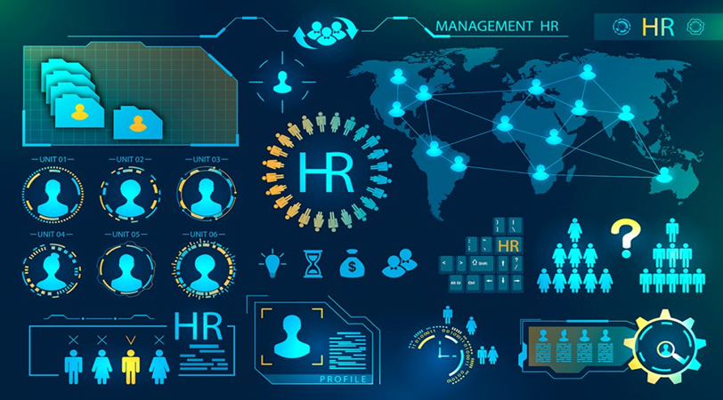

---

**Tools used:** Tableau, Power BI, MS SQL Server

## Project Links
- [GitHub Repository](https://github.com/Vishnuvarthan-M/HR-Analytics.git)
- [Google Drive Folder](https://drive.google.com/drive/folders/1UaR5bSsqO7tVL__2X9_rYzrU5Lnk5jBN?usp=sharing)
- [Dataset used](https://github.com/Vishnuvarthan-M/HR-Analytics/files/14546814/hrdata.csv)

---

# Business Problem
A company faces difficulty in analyzing and monitoring employee data across a large workforce. With thousands of records, HR teams need a clear and efficient way to understand retention patterns, workforce demographics, and employee experience trends. Without structured analysis, it becomes challenging to identify why employees leave, which departments are at risk, and how job satisfaction, age, and education background influence attrition.

The objective of this project is to provide actionable insight through interactive dashboards that help HR managers make data-driven decisions related to retention, recruitment, employee engagement, and workforce planning.

# Solution
The HR Analytics project uses Tableau, Power BI, and SQL to transform raw employee data into meaningful dashboards and KPIs. The analysis includes data cleaning, validation, and visual exploration of employee metrics such as headcount, attrition count, attrition rate, employee age groups, department-wise trends, and job satisfaction.

## Step Overview
- Dataset collection
- Understanding the data
- Data cleaning and null handling
- Validation checks
- Dashboard development in Tableau and Power BI
- SQL-based QA testing and verification

## Data Cleaning
- Removing duplicates
- Standardizing formatting
- Checking spelling and data consistency
- Trimming unwanted spaces
- Handling missing values
- Validating categorical values and defects

---

## Data Visualization

### 1) Tableau Dashboard

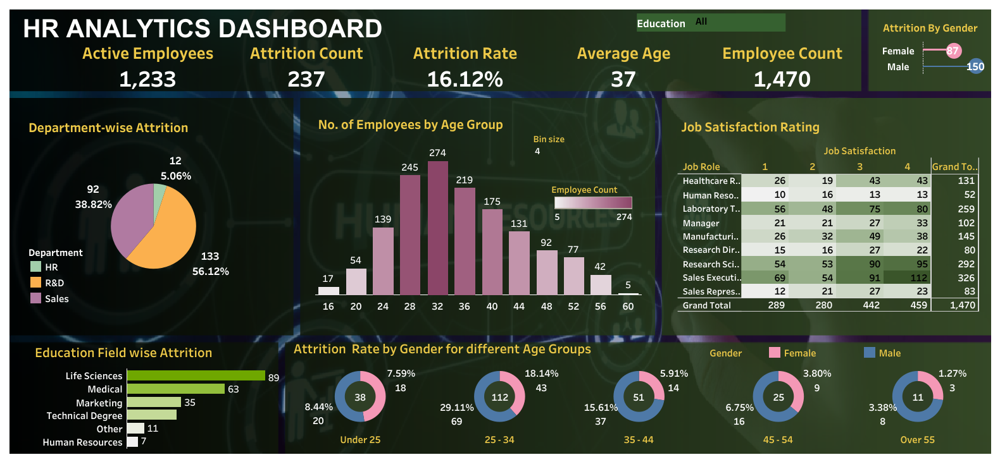

### 2) Power BI Dashboard

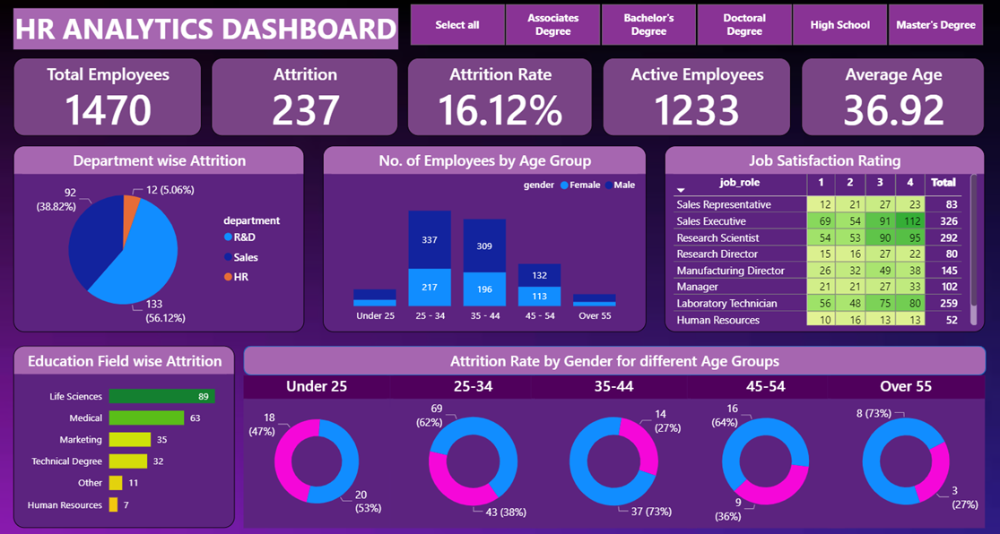

---

# Dashboard Contents

## KPI

### 1. Employee Count

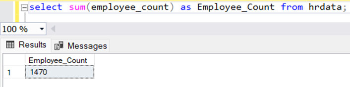

This metric helps HR teams assess current workforce size and plan future hiring, expansion, or restructuring decisions.

### 2. Attrition Count

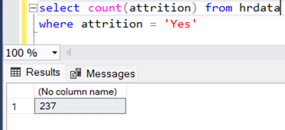

This KPI provides the number of employees who have left the organization, helping measure turnover in a clear and actionable way.

### 3. Attrition Rate

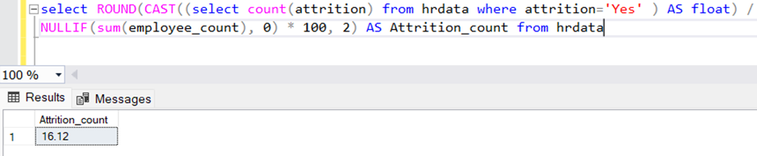

This metric shows the percentage of employees leaving, making it easier to track turnover and compare performance against benchmarks.

### 4. Active Employees

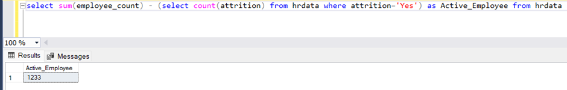

This metric helps distinguish active employees from those who have exited, which is important for workforce planning and productivity tracking.

### 5. Average Age

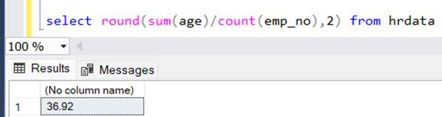

This provides a quick view of workforce demographics and helps support succession planning and age-balance analysis.

---

## Charts

### 1) Attrition by Gender

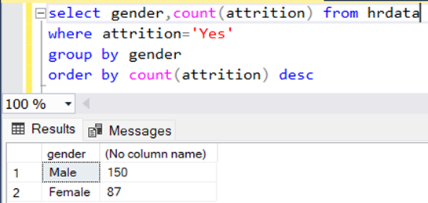

This chart shows how attrition varies by gender, helping identify whether gender-based disparities exist and where retention strategies may need adjustment.

### 2) Department-wise Attrition

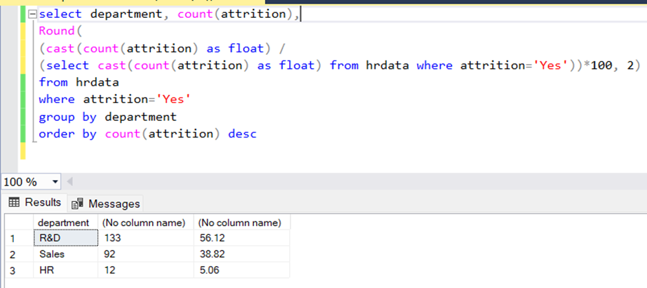

This view highlights attrition across departments, making it easier to identify teams with high turnover and the need for targeted intervention.

### 3) Number of Employees by Age Group

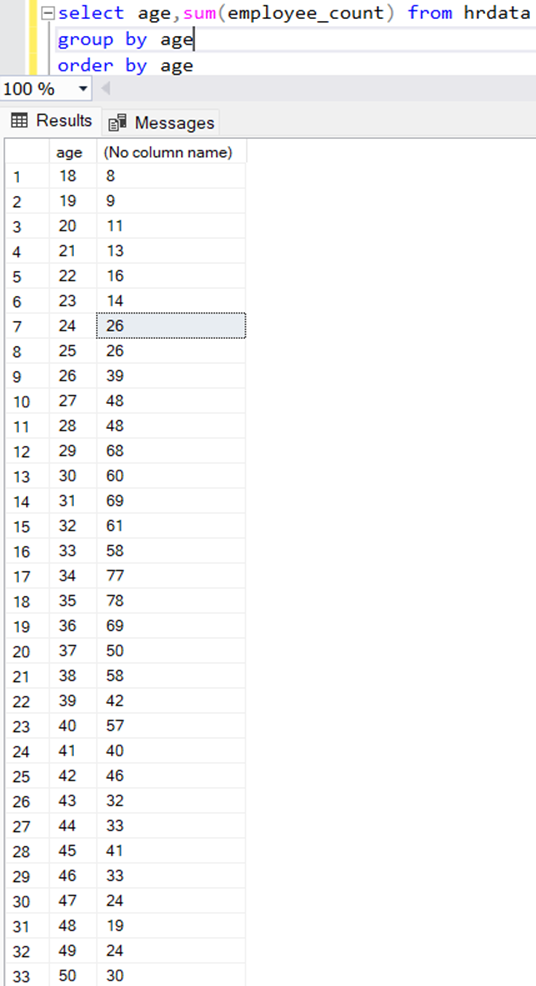

This chart helps analyze workforce distribution across age bands so HR can assess demographic balance and alignment with organizational goals.

### 4) Job Satisfaction Ratings

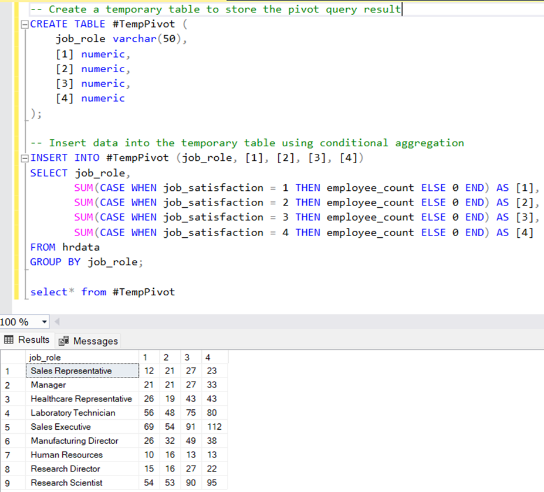

This chart helps represent employee satisfaction levels and supports better measurement of overall engagement and workplace experience.

### 5) Education Field-wise Attrition

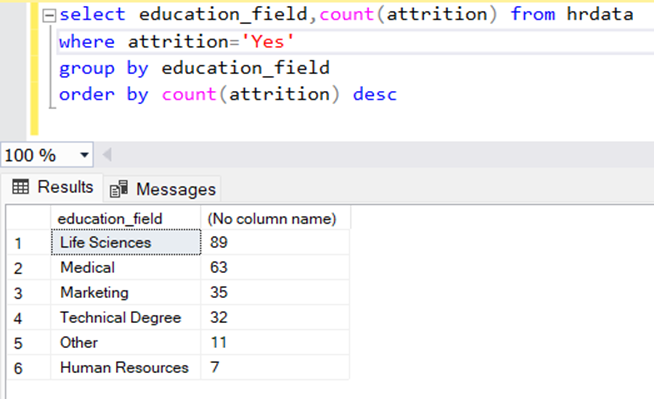

This visualization shows attrition by education background, helping organizations understand whether certain academic profiles are more likely to leave.

### 6) Attrition Rate by Gender for Different Age Groups

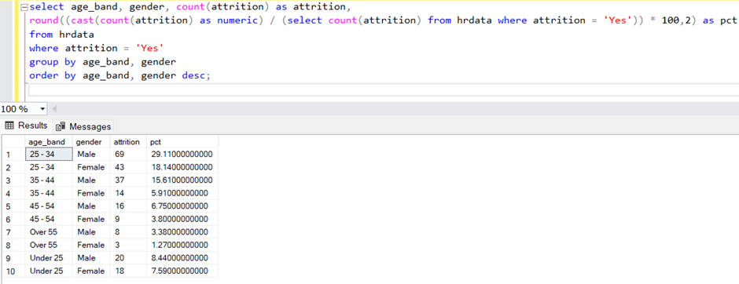

This chart combines age and gender segmentation to reveal attrition trends across employee groups and supports more targeted retention strategies.

---

# QA Testing (Quality Assurance)

1. **Functional Validation** - verifying that all filters, actions, and dashboard interactions behave as intended.
2. **Data Validation** - checking that values in Tableau and Power BI align with SQL-based calculations and expected business logic.

- [SQL Queries for Analyzing and Testing Reports](https://github.com/Vishnuvarthan-M/HR-Analytics/blob/main/SQL%20Analysis-%20Testing%20Tableau%20%26%20Power%20BI%20Reports)

---

# Conclusion
The HR Analytics Dashboard project provides a complete view of workforce health by combining business metrics, demographic segmentation, and attrition analysis. By using Tableau, Power BI, and SQL together, the project delivers a practical and scalable approach for HR reporting and decision-making.

The dashboard helps HR leaders identify retention risks, compare trends across departments and age groups, and understand how engagement and education backgrounds relate to attrition. It is a valuable tool for driving better people strategies and improving organizational performance.

